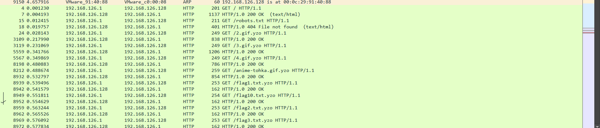
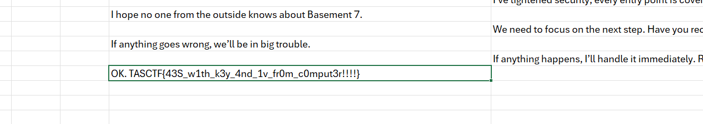
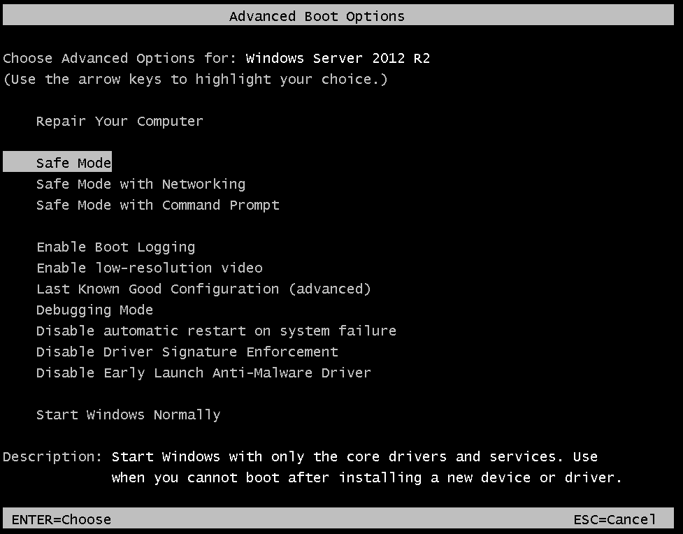
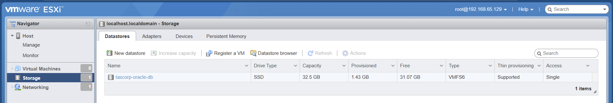
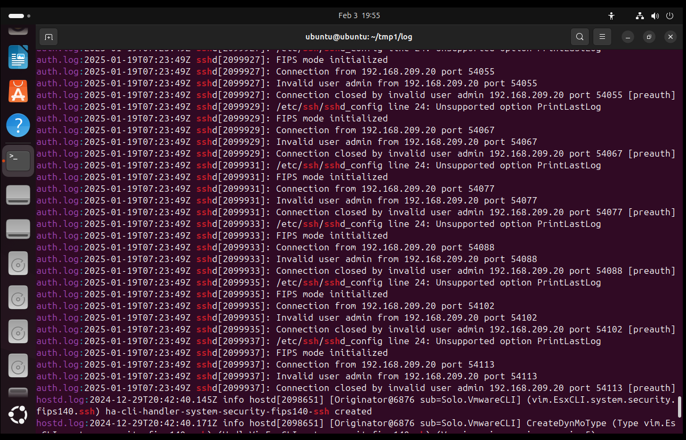
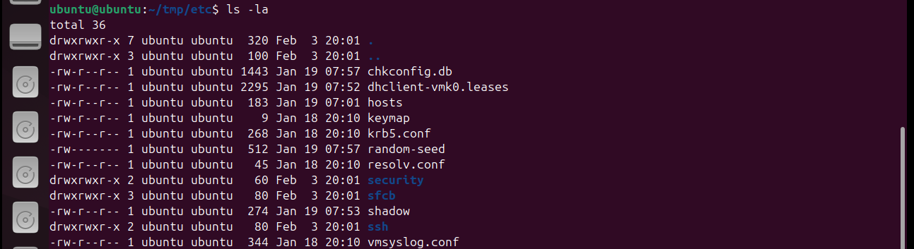
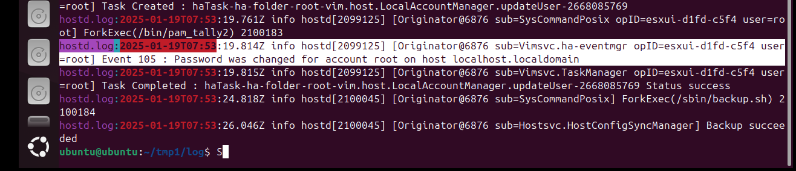
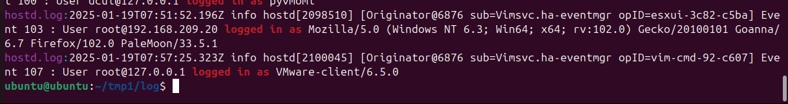
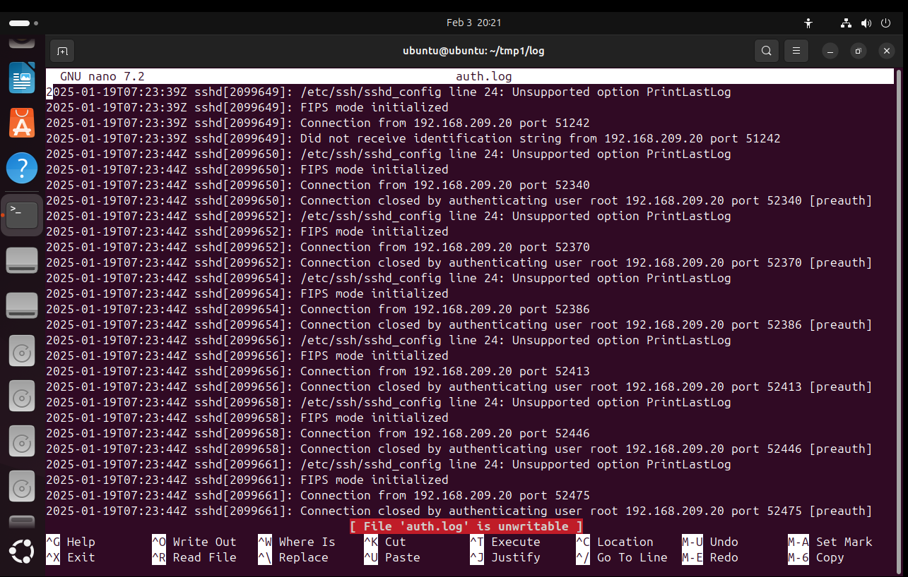

# TAS TET CTF (2025) Writeup

Bản thân cũng chưa từng chơi CTF bao giờ (đây là lần đầu tiên), và cũng chưa từng làm writeups luôn - có gì sai sót mọi người thông cảm ^^

**Writeups này sẽ chia thành các phần nhỏ, theo format (Category - Solved/Total problems):**

* Web - (3/6 problems)

* Forensics - (3/5 problems)

* Pwnable - not yet

* Reversing - (2/3 problems)

* Crypto - not yet

* OSINT - (1/2 problems)

# Web
# Typeracer (100 points/12 solves)

**Flag:** `TASCTF{Typ1ng_M4st3r_Unl0ck3d!}`

**Description:** Gõ nhanh thì thắng :))

**Given URL**: http://chall.tlualgosec.com:6902/

Đúng như cái tên đề bài, vào phát được mừng tuổi luôn quả "gõ" chữ đúng bài luôn - nhưng đời không như là mơ, web không cho copy để "rút ngắn thời gian", và khi mà chúng ta gõ xong thì web sẽ disable textbox, không cho phép copy từ đấy ra (thực ra cũng có cách là dùng F12 ở đây nhưng thực sự rất là mất thời gian, nên mình xin phép chơi theo phong cách của mình).


Không sao cả, thua keo này ta bày keo khác. Nếu như các bạn nhớ ngoài `Ctrl + C` (để copy) thì nên nhớ rằng, `Ctrl + X` (để cut) tồn tại - và clipboard luôn persist cho đến khi bạn đè một thứ gì đó mới lên clipboard. Để tránh việc bị disable textbox thì mình chỉ gõ đến `chữ cái cuối cùng - 1` trước khi cái xâu đó kết thúc. Ngồi chơi đúng 7 phút chỉ có lặp lại 2 thao tác `Ctrl + X` và `Ctrl + V`, cuối cùng mình cũng đã có được flag - ông nào ra đề quỷ thật :D

Sau khi xong xuôi, việc còn lại là Submit. Và flag của bài này cũng không copy được luôn, nên mình đã phải viết bằng tay sau đó cut ra để copy flag :)


# Role changing (244 points/9 solves)

**Flag:** `TASCTF{E4$y_r0Le_ChaN9!Ng}`

**Description:** You must be admin, provide credential `user:userpass`

**Given URL:** http://chall.tlualgosec.com:745/

Đầu tiên, truy cập vào URL thì ta thấy được web có 1 panel login:

Sử dụng credentials `user` cho Username, và `userpass` cho Password, web trả về 1 page trống trơn với link duy nhất bấm được là logout. Nhưng, bấm logout thì lại quay lại login page. Nên ở đây cũng không có gì để xem cả. Tiếp tục sử dụng Developer Tools bằng cách `F12`, ta thấy được 1 dòng bị commented out - cách comment 1 dòng của HTML tương tự như XML, việc còn lại chỉ là xoá `<!-- changing role click here` và ` -->` đi.

Sau khi sửa xong, lưu lại thay đổi - ta có thể thấy - [Role](http://chall.tlualgosec.com:745/?role=1) đã xuất hiện, click vào role và chạy lệnh `cat` ta đã thấy được flag!


# Người đi dạo (356 points/7 solves)

**Flags:** `TASCTF{3asy_FilE_pa7h_7R@V31Sa1}`

**Description:**: I got lost, can you show me the path back to my home?

**Given URL:**: http://chall.tlualgosec.com:5000/

Bài này đầu tiên cho chúng ta index của 1 web (không hẳn là index) - nhưng khi bấm vào file để tải về thì link giờ đã có đi kèm thêm suffix `/download?file=<filename>`.

Nếu mọi người đã biết về Path Traversal, thì việc khai thác lỗ hổng ở đây khá đơn giản. Còn nếu chưa biết thì hãy đọc ở [đây](https://owasp.org/www-community/attacks/Path_Traversal) - đây gần như là web mô tả rõ nhất về cách hoạt động của Path Traversal.

Còn về bài này, tất cả những gì mình đã làm là thử một vài path quen thuộc (thường flag sẽ nằm ở root) và trong trường hợp này nó nằm ở root thật :)

**Path để lấy flag:** `../../../../../flag.txt`, và link của chúng ta giờ sẽ nhìn như dưới, kèm theo flag luôn:


Đây là phần writeup riêng cho phần Web của mình.

# Forensics
# Just Hello (400 points/4 solves)

**Flags:** `TASCTF{43S_w1th_k3y_4nd_1v_fr0m_c0mput3r!!!!}`

**Attachments:** [justhello](https://www.mediafire.com/file/4z5adfrxiqa14r8/justhello.pcapng)

Ở đây chúng ta sử dụng Wireshark - vì đây là 1 file `.pcapng`. Thực ra thì cũng có thể mở được bằng tool khác, nhưng ở đây Wireshark sẽ được đưa vào sử dụng.

Filter các request GET ra, ta có thể thấy được vài file đã GET được trong 
này:



Tiến hành export ra 1 thư mục, ta thấy được trong này gần như mọi file đều có đuôi kết thúc bằng `.yzo` - như kiểu 1 dạng mã hoá.

Mở đến file `lock.html` bằng 1 trình text editor ta thấy được 1 file được viết bằng ngôn ngữ Python.

Đọc qua code, ta thấy các file `.yzo` được mã hoá bằng phương thức AES-256 CBC Mode Initialization Vector vì key giải mã được cho trong bài này là key 32-bytes.

`happynewyear2025bykozybeartasclb`

**Để tìm hiểu thêm:**

Về CBC Mode trong AES Encryption, vui lòng truy cập [đường dẫn này.](https://xilinx.github.io/Vitis_Libraries/security/2019.2/guide_L1/internals/cbc.html#:~:text=The%20Cipher%20Block%20Chaining%20(CBC,192%2F256%20bits%20for%20AES.))

Về Initialization Vector, vui lòng truy cập [đường dẫn này.](https://www.techtarget.com/whatis/definition/initialization-vector-IV)

Quay lại vấn đề chính, việc của chúng ta là phải decrypt được các file kết thúc bằng đuôi `.yzo`.


Tiến hành rewrite code để decrypt:

```
import os
from Crypto.Cipher import AES
import binascii

def decrypt_file(input_file, output_file, key):
    with open(input_file, 'r') as f_in:
        data = f_in.read()

    # Split the IV and encrypted data
    iv_hex = data[:32]  # The first 32 hex characters represent the IV
    encrypted_data_hex = data[32:]  # The rest is the encrypted data

    iv = binascii.unhexlify(iv_hex)
    encrypted_data = binascii.unhexlify(encrypted_data_hex)

    # Create the cipher object and decrypt the data
    cipher = AES.new(key, AES.MODE_CBC, iv)
    decrypted_data = cipher.decrypt(encrypted_data)

    # Remove padding
    padding_length = decrypted_data[-1]
    decrypted_data = decrypted_data[:-padding_length]

    with open(output_file, 'wb') as f_out:
        f_out.write(decrypted_data)

    print(f"Decrypted file written to: {output_file}")

def decrypt_folder(input_folder, output_folder, key):
    if not os.path.exists(output_folder):
        os.makedirs(output_folder)

    for root, dirs, files in os.walk(input_folder):
        for file in files:
            if file.endswith('.yzo'):  # Only decrypt .yzo files
                input_file = os.path.join(root, file)
                relative_path = os.path.relpath(input_file, input_folder)
                output_file = os.path.join(output_folder, relative_path.replace('.yzo', ''))
                decrypt_file(input_file, output_file, key)

key = b'happynewyear2025bykozybeartasclb'

input_folder = './ENCRYPTED'
output_folder = './DECRYPTED'

decrypt_folder(input_folder, output_folder, key)
```

Bỏ hết các file `.yzo` vào trong thư mục `ENCRYPTED`, chạy script lên ta thu được các file ảnh/flag. Nhưng các file đó đều chứa các garbage strings, gifs, ...

Đó không phải điều chúng ta quan tâm.

Mở file `secret_chat.xlsx` ra, ta thấy được flag.



# DFIR (1-2)

**Flag:** 

DFIR-1: `TASCTF{ESX1_R3SET_P4SSW0RD_L1K3_4_PR0}`

DFIR-2: `TASCTF{L0G_4N4LYS1S_1S_TH3_K3Y_T0_SUCC3SS}`

**Attachment:** [here](https://drive.google.com/drive/folders/1OqCIVuE5-sBmJHjKmh6_zkNK8Xa7Bja2)

**Description:**
Hệ thống máy chủ chính của TASCorp vừa bị xâm nhập, chứa nhiều dữ liệu quan trọng của người dùng cũng như các bí mật kinh doanh. Hiện trạng sự cố được miêu tả chi tiết trong tệp đính kèm. Liệu bạn có thể hỗ trợ tập đoàn truy lùng kẻ xâm nhập?

Các chuyên gia ứng cứu sự cố đã nhanh chóng cô lập hệ thống và lưu lại trạng thái các máy chủ.

Pass giải nén: `TASCTF@2025`

Server: `nc chall.tlualgosec.com 1200`

Để làm được bài này, bạn cần chuẩn bị 1 Liveboot CD nhẹ nhẹ để mount phân vùng chứa credentials của ESXi là được. Ở đây mình dùng nguyên 1 bộ cài Ubuntu luôn để tiện cho việc điều tra thêm, nặng tầm ~6GB.

Không sao cả, ổ cứng vô hạn :D

# DFIR-1

Import VMDK vào trong VMWare và boot lên, ta có thể trả lời được luôn câu 1:

```
Câu hỏi 1:
Hãy giúp đội ứng cứu sự cố xác định phiên bản của máy chủ ESXi.
```

Và câu trả lời đúng cho câu hỏi trên là:
`VMWare ESXi 6.7.0 (VMKernel Release Build 15160138)`

Để xoá được password của user `root` để giành lại quyền truy cập ESXi, bạn có thể tham khảo video [này] - ở đây mình thay CD Boot bằng bộ cài Ubuntu (https://www.youtube.com/watch?v=bp_YVZRdXjg).

Sau khi reset xong password, bạn đã có quyền superuser.

Tiếp tục, câu hỏi thứ 2:

```
Câu hỏi 2:
Máy chủ VEEAM có địa chỉ hostname là gì?
```

Để làm được câu hỏi này, ta cần import disk VEEAM Backup vào VMWare.

Để tiện cho việc điều tra sâu hơn vì tôi nghĩ không ai sẽ thấy ổn vì việc để XMRig chạy trong background và ăn tận 70% CPU xuyên suốt quá trình VM mở, nên vừa ngay sau khi import, boot nó lên và spam F8 ngay ở BIOS splashimage để lên Windows Boot Manager (Advanced Options), chọn vào Safe Mode.



Để tìm hiểu thêm về XMRig, nhấn vào [đây](https://xmrig.com/docs/miner).

Một khi đã boot vào được hệ thống, vào ngay đường dẫn `C:\Users\Admin\Downloads` và xoá ngay thư mục `xmrig-windows-service-scripts-master`

Nếu muốn an toàn hơn, xoá luôn các file/thư mục sau:

* C:\Users\Admin\Downloads\fscan.exe

* C:\Users\Admin\Downloads\LB3.exe

* C:\Users\Admin\Downloads\hack-browser-data-windows-64bit

Sau đó để kiểm tra hostname - mở `cmd` chạy lệnh sau:

`hostname`

Kết quả return lại của command chính là địa chỉ hostname của câu hỏi trên.

Đáp án đúng: `WIN-6TU5QQPCRUS`

Tiếp tục sang câu hỏi 3:

```
Câu hỏi 3:
Decryption ID Địa chỉ email của hacker hệ thống bị mã hóa?
```

Mở file `FmEVJE0iq.README.txt`. Nó nằm luôn ở Desktop, và nằm ở root của 1 vài thư mục khác được mã hoá (trừ `C:\Windows` và 1 vài thư mục khác, kể ra sẽ rất dài nên tôi không nói ở đây.)

Lướt từ trên xuống trong file text một chút, ta thấy Decryption ID:

```
Your personal DECRYPTION ID: B7568014A48684D6D525F3F3722638C4
```

Đáp án đúng của câu hỏi 3 là: `B7568014A48684D6D525F3F3722638C4`.

Tiếp tục, câu hỏi 4:

```
Câu hỏi 4:
Khi mật khẩu root của máy chủ ESXi bị đổi và không thể truy cập, phương pháp nào sau đây là đúng để reset mật khẩu mà không cần cài đặt lại hệ điều hành?
A. Cài đặt lại hệ điều hành ESXi và tạo mật khẩu mới
B. Boot từ một USB chứa LiveCD của hệ điều hành Linux, sau đó chỉnh sửa tập tin "shadow" để reset mật khẩu
C. Khởi động lại máy chủ và mật khẩu sẽ tự động được đặt lại
D. Tắt máy chủ và chờ nhà cung cấp hỗ trợ
```

Câu này bạn chỉ cần sử dụng guide xoá password ở trên, ta có thể dễ dàng nhận ra đáp án B là đúng.

Đáp án đúng của câu hỏi 4 là: `B`.

Tiếp đến câu hỏi cuối cùng của DFIR-1:

```
Câu hỏi 5:
Tên ổ đĩa của máy ảo oracleDB trên máy chủ ESXi?
```

Đầu tiên chúng ta truy cập vào ESXi Control Panel bằng DHCP đã được cấp ngay lúc khởi động.

Truy cập vào phần Storage (góc trái màn hình)



Đáp án đúng của câu 5 là: `tascorp-oracle-db`.

# DFIR-2
Riêng quest này nên dùng LiveCD để xử lý!

Import lại ESXi VMDK và tạo 1 VM mới, và không reset lại password!

Đầu tiên là bạn cần 1 Liveboot CD. Sau khi đã có ít nhất terminal access vào rồi thì hãy mount `/dev/sda5` và `/dev/sda2` vào các nơi mà bạn muốn.

`/dev/sda5` chứa state.gz, chứa `shadow` lúc chưa được modified.

`/dev/sda2` chứa system logs lúc chưa modified, vô cùng hiệu quả cho việc troubleshooting.

Đến với câu hỏi đầu tiên:
```
Câu hỏi 1:
Địa chỉ IP từng kết nối ssh tới máy chủ ESXi?
```

Các SSH session thường sẽ được lưu vào auth.log (nếu các bạn dùng `ssh` thì sẽ có đường dẫn là `/var/log`), còn ở LiveCD sẽ là trong nơi mà bạn vừa mount `/dev/sda2`, thư mục `log` sẽ nằm trong đó.

SSH daemon (`sshd`) sẽ log lại hết các attempt kết nối SSH, cho nên là kể cả fail thì log vẫn sẽ được print.

Cho rằng bạn đang ở thư mục log, chạy command sau để lấy các log do `sshd` print ra:

```
cat auth.log | grep sshd
```

Ta thấy luôn IP dưới xuất hiện rất nhiều lần:



Đáp án đúng cho câu hỏi 1: `192.168.209.20`.

Câu hỏi tiếp theo:

```
Câu hỏi 2:
Thời gian lần đổi mật khẩu ESXi cuối cùng
```

Để làm được câu này, bạn cần giải nén `state.gz/local.gz` để lấy được `shadow`.

Ở thư mục `$(shell pwd)/etc` sau khi giải nén, chạy command `ls -la` để lấy last modified của file `shadow`:



Ta thấy được file được modify lần cuối vào ngày 19/01/2025, vào lúc 07:53. **(1)**

Nếu như bạn có để ý đến file log bên trên, thì timestamps của một vài log trên ESXi sẽ có format như sau:

```
YYYY-MM-DDTHH:mm:ss.SSSZ
```

Lắp các info trên (1) vào:

```
2025-01-19T07:53
```

Phần giây không quan trọng, vì tìm thông tin chỉ ngần này là đủ rồi.

Về lại thư mục mà `/dev/sda2` đã được mount vào, sau đó chạy tiếp ở `$(shell pwd)/log` command sau:

```
grep -r 2025-01-19T07:53
```

Và ta thấy ngay timestamp mà password đã bị đổi:



Đáp án đúng cho câu hỏi 2: `2025-01-19T07:53:19.814Z`

Câu hỏi tiếp theo:

```
Câu hỏi 3:
User-Agent của kẻ tấn công
Câu trả lời:
```

Để tìm được User-Agent của kẻ tấn công (thường nằm trong hostd.log),
chạy command sau (vẫn ở thư mục đã được `/dev/sda2` mount vào)

```
grep -r "logged in as"
```

Output sẽ trả về:



Từ đây ta thấy User-Agent đáng nghi nhất vẫn là từ `root@192.168.209.20`.

Đáp án đúng cho câu 3 là:
```
Mozilla/5.0 (Windows NT 6.3; Win64; x64; rv:102.0) Gecko/20100101 Goanna/6.7 Firefox/102.0 PaleMoon/33.5.1
```

Tiếp tục với câu cuối cùng của DFIR-2:

```
Câu hỏi 4:
Thời gian sớm nhất ghi nhận các hành vi rà quét của kẻ tấn công trong log của máy chủ ESXi? (Format: YYYY-MM-DD HH)
```

Quay lại auth.log, vì file này store mọi SSH attempts.



Ta thấy luôn IP `192.168.209.20` đã abuse rất nhiều lần, từ đó có thể suy ra luôn đáp án.

Đáp án đúng cho câu 4 là: `2025-01-19 07`

Và đó là phần Forensics.
