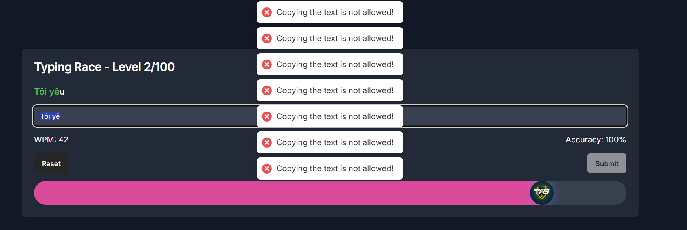
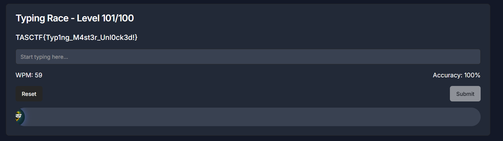
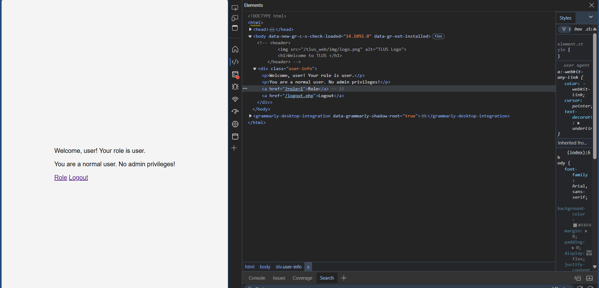
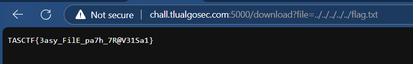

# TAS TET (2025) Writeup

Bỏ ăn bỏ cả Tifa bỏ cả chục projects AOSP dang dở để đấm CTF, đây là writeup và cũng như lần đầu thi đấu CTF của tôi nên có gì sai sót mọi người thông cảm (hoặc có thể góp ý cho mình qua các social platforms bên dưới nhé) :D :D :D :D :D

**Writeups này sẽ chia thành các phần nhỏ, theo format (Category - Solved/Total problems):**

* Web - (3/6 problems)

* Forensics - (3/5 problems)

* Pwnable - not yet

* Reversing - (2/3 problems)

* Crypto - not yet

* OSINT - (1/2 problems)

# Web
### Typeracer (100 points/12 solves)

**Flag:** `TASCTF{Typ1ng_M4st3r_Unl0ck3d!}`

**Description:** Gõ nhanh thì thắng :))

**Given URL**: http://chall.tlualgosec.com:6902/

Đúng như cái tên đề bài, vào phát được mừng tuổi luôn quả "gõ" chữ đúng bài luôn - nhưng đời không như là mơ, web không cho copy để "rút ngắn thời gian", và khi mà chúng ta gõ xong thì web sẽ disable textbox, không cho phép copy từ đấy ra (thực ra cũng có cách là dùng F12 ở đây nhưng thực sự rất là mất thời gian, nên mình xin phép chơi theo phong cách của mình).

Không sao cả, thua keo này ta bày keo khác. Nếu như các bạn nhớ ngoài `Ctrl + C` (để copy) thì nên nhớ rằng, `Ctrl + X` (để cut) tồn tại - và clipboard luôn persist cho đến khi bạn đè một thứ gì đó mới lên clipboard. Để tránh việc bị disable textbox thì mình chỉ gõ đến `chữ cái cuối cùng - 1` trước khi cái xâu đó kết thúc. Ngồi chơi 10 phút chỉ có lặp lại 2 thao tác `Ctrl + X` và `Ctrl + V`, cuối cùng mình cũng đã có được flag - ông nào ra đề quỷ thật :D Sau khi xong xuôi, việc còn lại là Submit:

Và flag của bài này cũng không copy được luôn, nên mình đã phải viết bằng tay sau đó cut ra để copy flag :).

Bài này dừng lại ở đây.

### Role changing (244 points/9 solves)

**Flag:** `TASCTF{E4$y_r0Le_ChaN9!Ng}`

**Description:** You must be admin, provide credential `user:userpass`

**Given URL:** http://chall.tlualgosec.com:745/

Đầu tiên, truy cập vào URL thì ta thấy được web có 1 panel login:

Sử dụng credentials `user` cho Username, và `userpass` cho Password, web trả về 1 page trống trơn với link duy nhất bấm được là logout. Nhưng, bấm logout thì lại quay lại login page. Nên ở đây cũng không có gì để xem cả. Tiếp tục sử dụng Developer Tools bằng cách `F12`, ta thấy được 1 dòng bị commented out - cách comment 1 dòng của HTML tương tự như XML, việc còn lại chỉ là xoá `<!-- changing role click here` và ` -->` đi.

Sau khi sửa xong, lưu lại thay đổi - ta có thể thấy - [Role](http://chall.tlualgosec.com:745/?role=1) đã xuất hiện, click vào role và chạy lệnh `cat` ta đã thấy được flag!

### Người đi dạo (356 points/7 solves)

**Flags:** `TASCTF{3asy_FilE_pa7h_7R@V31Sa1}`

**Description:**: I got lost, can you show me the path back to my home?

**Given URL:**: http://chall.tlualgosec.com:5000/

Bài này đầu tiên cho chúng ta index của 1 web (không hẳn là index) - nhưng khi bấm vào file để tải về thì link giờ đã có đi kèm thêm suffix `/download?file=<filename>`.

Nếu mọi người đã biết về Path Traversal, thì việc khai thác lỗ hổng ở đây khá đơn giản. Còn nếu chưa biết thì hãy đọc ở [đây](https://owasp.org/www-community/attacks/Path_Traversal) - đây gần như là web mô tả ro nhất về cách hoạt động của Path Traversal.

Còn về bài này, tất cả những gì mình đã làm là thử một vài path quen thuộc (thường flag sẽ nằm ở root) và trong trường hợp này nó nằm ở root thật :)

**Path để lấy flag:** `../../../../../flag.txt`, và link của chúng ta giờ sẽ nhìn như dưới, kèm theo flag luôn:

Đây là phần writeup riêng cho phần Web của mình.